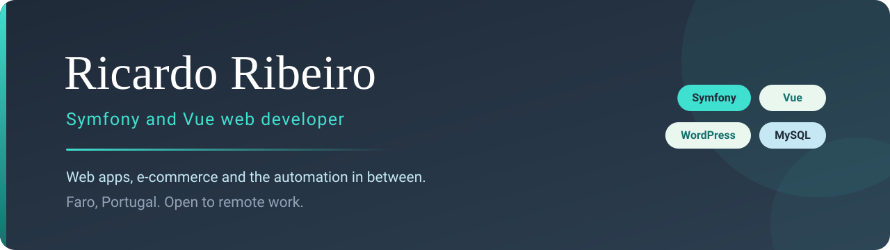
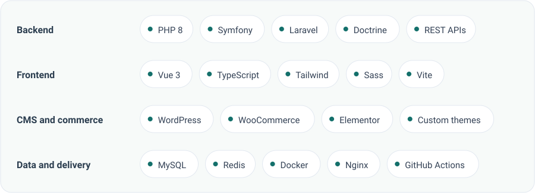

  

I build web applications. Symfony on the back end, Vue on the front, and WordPress or WooCommerce when a custom build would be the wrong tool for the job.

I'm in Faro, Portugal, and I work remotely with clients across Europe. Most of what I do is unglamorous. Untangling a legacy PHP codebase that had stopped accepting new features. Finding the query behind a page that took four seconds. Moving a project off SVN and onto Git. None of that belongs on a sales page, and it is exactly what decides whether a business can keep moving.

When the same problem shows up twice, I automate it. A crawler I wrote tracks competitors' fabric prices overnight so a buyer doesn't have to, and the dashboard it feeds gets opened every morning.

## Tools I reach for

<picture>
  <source media="(prefers-color-scheme: dark)" srcset="assets/stack-dark.svg">
  
</picture>

Symfony and Vue are home base. PHP 8 with strict types, Doctrine, MySQL. Docker and Nginx for the plumbing, and GitHub Actions so I don't have to remember what to type on deploy day.

## Some of the work

**Pvc Directo.** Full stack build for a PVC fabrication business: development, design, deployment and the email server migration. Symfony with a MySQL back end and Google Maps on the contact page.

**Price Crawler and Dashboard.** A scraper that watches competitors' fabric prices, plus a dashboard the client uses daily. I built it alone, end to end, in Symfony with Panther and EasyAdmin.

**cs2smokes.** A guide platform for CS2 players with video content the editors manage themselves, so publishing a page never needs to go through me. Symfony and Tailwind.

Before that I spent years inside larger teams: a PIM and DAM platform at ContentServ, agency projects at Waynext and PLM, and rebuilding a legacy e-commerce platform at Clubefashion.

## Writing

I write about the problems I run into, mostly so I don't have to solve them twice.

- [PHP tips that save me time every week](https://rsribeiro.site/blog/php-tips-that-save-me-time-every-week)
- [Jev returns decisions instead of sentences](https://rsribeiro.site/blog/jev-returns-decisions-instead-of-sentences)
- [Symfony, plain PHP or WordPress: how to pick](https://rsribeiro.site/blog/symfony-plain-php-or-wordpress-how-to-pick)
- [Run Ollama locally: a no-nonsense setup guide](https://rsribeiro.site/blog/run-ollama-locally-a-no-nonsense-setup-guide)

More on [rsribeiro.site/blog](https://rsribeiro.site/blog).

## Where to find me

I'm open to remote work. Email is the fastest way to reach me.

[rsribeiroit@gmail.com](mailto:rsribeiroit@gmail.com) · [rsribeiro.site](https://rsribeiro.site) · [LinkedIn](https://www.linkedin.com/in/ricardo-s-ribeiro/)

---

Banner and tool cards are hand-written SVG, generated by <a href="generate_assets.py">generate_assets.py</a> from the palette on my site. Labels get measured in a headless browser before they are drawn, because guessing text width in SVG clips words.
